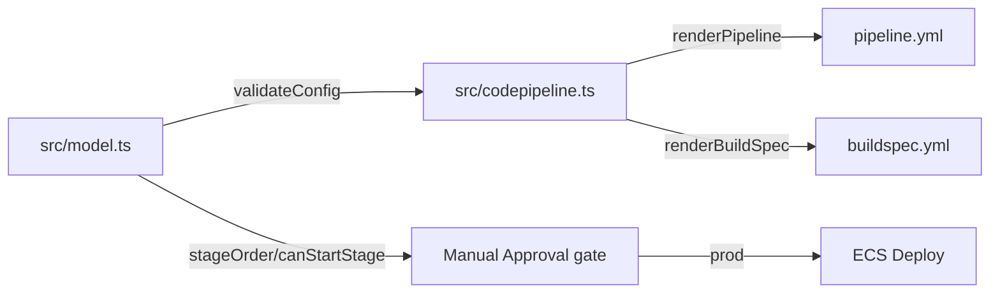

# AWS CodePipeline — delivery pipeline renderer

Source: project-21-aws-codepipeline (каталог, стр. 120 записей).
Short English TL;DR below.

## TL;DR (EN)

`p21-aws-codepipeline` is a small TypeScript renderer that turns a typed
config into an AWS CodePipeline YAML (Source -> Build -> Staging ->
Manual Approval -> Deploy) plus a CodeBuild buildspec and a cheat sheet.
It validates the config, applies a manual approval gate between staging and
prod, and never hardcodes credentials (SNS ARNs use a placeholder account id).
Everything runs with **no AWS account** — pure rendering + Node built-in tests.

## Задача

Генерировать манифест пайплайна доставки интернет-магазина: источник из
GitHub, сборка в CodeBuild, каталог в staging, ручное подтверждение перед
prod и выкат в ECS. Код работает без AWS-аккаунта — только рендер и тесты.

## Архитектура



Слои: `src/model.ts` (конфиг + валидация), `src/codepipeline.ts`
(YAML-рендеры), `src/cli.ts` (CLI: `--check`, `--render`, `--spec`, `--sheet`).

## Быстрый старт

```powershell
npm ci
npm run verify   # tsc --noEmit + node --test
npm run check    # самопроверка CLI
npm run cli -- --render -o pipeline.yml
npm run cli -- --spec  -o buildspec.yml
```

## CLI

| Флаг | Действие |
|------|----------|
| `--check` / `-c` | самопроверка модели и рендеров |
| `--render` / `-r` | вывести/записать pipeline.yml |
| `--spec` / `-s`   | вывести/записать buildspec.yml |
| `--sheet` / `-h`  | шпаргалка по стадиям |

## Переменные окружения

| Переменная | Зачем | Пример |
|------------|-------|--------|
| `P21_ARTIFACT_BUCKET` | S3-бакет артефактов (whitelist) | `cp-shop-artifacts` |
| `P21_REGION` | регион пайплайна | `eu-central-1` |
| `P21_APPROVAL_STAGE` | имя стадии ручного гейта | `ProdApproval` |

Остальные поля CRUD через `DEFAULT_CONFIG` в `src/model.ts`; в реальном
репозитории ключей нет — ARN плейсхолдер `000000000000`.

## Тесты

```powershell
npm test        # node --test tests/**
npm run verify  # + typecheck (tsc --noEmit)
```

Unit-тесты без сети и без AWS-аккаунта (pure rendering).

## Docker

```powershell
docker build -t p21-aws-codepipeline .
docker compose run --rm verify
```

Контейнер запускает `npm run verify` и `npm run check` (non-root, slim node).

## Контакты
Telegram: @PavelYrevichh · GitHub: Shamanchi · FL.ru: https://www.fl.ru/users/Shamanchi