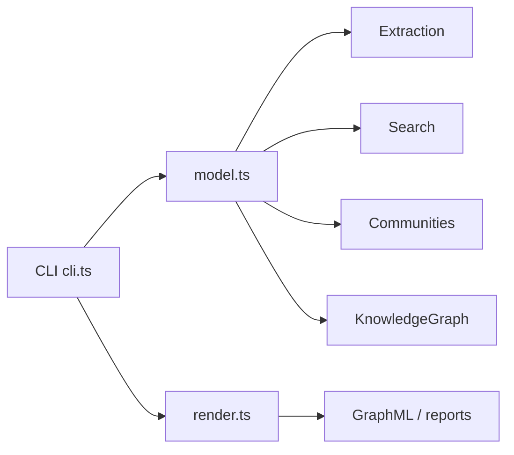

# p22-rag-graphrag

> GraphRAG Demo — локальное индексирование корпуса в граф знаний и ответы
> через local/global/communities поиск. Работает полностью офлайн, без внешних API.

## TL;DR (EN)

GraphRAG over a shop-services corpus. Builds a knowledge graph from plain-text
corpus (entities + relations), then answers with three search modes:
local (around one entity), global topics (by relation frequency), and
communities (connected components). No network calls, no API keys.

**Источник темы:** каталог запись P-022 `rag-knowledge-graphrag` (см.
[`КАТАЛОГ_ПОРТФОЛИО.md`](../../../КАТАЛОГ_ПОРТФОЛИО.md)). Идея и сценарий
заимствованы из учебного списка, реализованы самостоятельно на TypeScript.

## Что решает

- **Извлечение графа:** корпус разбивается на сущности (entity types) и связи
  (relation types) по словарным маркерам — без внешних NLP-моделей.
- **Три режима GraphRAG-поиска:**
  - `local <entity>` — подграф вокруг сущности (BFS, лимит
    `localSearchLimit`);
  - `global topics` — темы по частоте типов связей (`globalTopicLimit`);
  - `communities` — связные компоненты графа (`maxCommunities`).
- **Экспорт:** GraphML для визуализации, читаемые отчёты, валидация конфига.

## Архитектура



Слои (`src/`):

- `model.ts` — конфиг, токенизация, извлечение сущностей/связей, построение
  графа, BFS local/global/communities.
- `render.ts` — рендер GraphML и текстовых отчётов.
- `cli.ts` — разбор аргументов, диспетчеризация команд.

## Быстрый старт

```bash
npm install
npm run verify   # typecheck (tsc) + unit-тесты (node --test)
npm start -- --help
npm run check    # алиас verify (используется в CI)
```

Запуск команд:

```bash
npm start -- --validate            # валидация DEFAULT_CONFIG
npm start -- --local gateway       # локальный поиск вокруг "gateway"
npm start -- --global              # глобальные темы
npm start -- --communities         # сообщества (BFS-компоненты)
npm start -- --graph               # GraphML
```

Docker:

```bash
docker compose run --rm verify     # typecheck + тесты внутри контейнера
```

## Переменные окружения

Рабочий код читает конфигурацию из `DEFAULT_CONFIG` (в `src/model.ts`); все
переменные опциональны и имеют дефолты. Шаблон — `.env.example`.

| Переменная | Дефолт | Описание |
|------------|--------|----------|
| `RAGRAG_LANGUAGE` | `en` | Язык отчётов: `en` \| `ru` |
| `RAGRAG_MAX_COMMUNITIES` | `4` | Лимит сообществ |
| `RAGRAG_LOCAL_SEARCH_LIMIT` | `3` | Лимит local-поиска |
| `RAGRAG_GLOBAL_TOPIC_LIMIT` | `4` | Лимит глобальных тем |

## Тесты

```bash
npm test
```

`tests/graphrag.test.ts` покрывает: токенизацию, подсчёт частот, извлечение
сущностей/связей, построение графа, `neighbors`, `communities`, `local`,
`global` и диспетчеризацию CLI.

## CI

`.github/workflows/ci.yml` — на push/PR: установка зависимостей, `npm run verify`
(typecheck + тесты), через `actions/setup-node`.

## Лицензия и атрибуция

- Запись каталога: **P-022** `rag-knowledge-graphrag`.
- Стек: TypeScript 7 (NodeNext), Node.js 22, node:test — без внешних API.
- См. также `NOTICE.md`.
