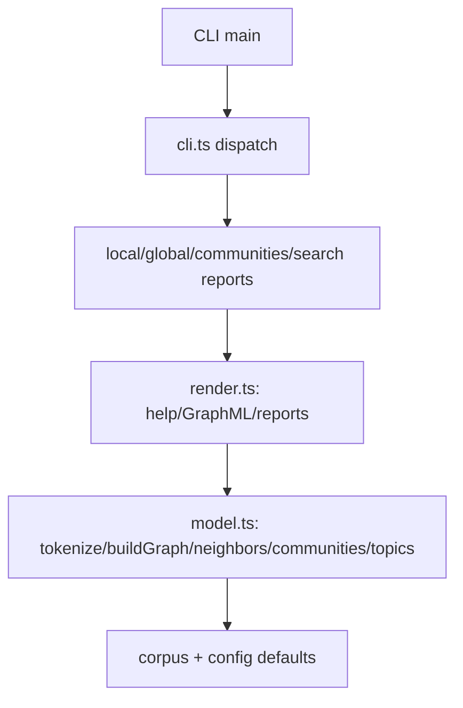

# p23-rag-graphrag-web-search

English TLDR: Offline, no-API GraphRAG demo over a shop-services corpus with
hybrid local/global search, connected-component communities/viz, deterministic
keyword "web search" (no network), and a GraphML/GraphMLML/help renderers.
Pluggable offline web-search fallback; runs fully without keys or internet.

**Topic source:** catalogue entry P-023 (web-based GraphRAG search). see NOTICE.md.

Версия (RU): GraphRAG с офлайн web-поиском по корпусу магазинных сервисов.
Без внешних API и сети: корпус + токенизация, поиск по энтити, темы, кластеры.

## What it solves

Pipelines with RAG across many documents struggle with:
1. Query drift: naive vector search misses linked entities.
2. No grounding: results have no sources/edges to verify.
3. Hard to explain: no community/topic view to understand the answer.
This demo builds a small KnowledgeGraph (entities + typed relations) from a
fixed corpus trick (shop-services, "auth via redis", "kafka topic shop-orders"),
then answers local / global / community / "web-search"-style queries offline.
No network, no keys - CI and demos always run.

## Architecture



## Quickstart

```bash
npm install
npm run verify     # typecheck + tests (no network)
npm start --local gateway   # local report
npm start --global          # global topics
npm start --communities     # clusters
```

## Commands (CLI)

| command | effect |
|---|---|
| `--help` | usage |
| `--local gateway` | local report around entity |
| `--global` | global topic list |
| `--communities` | community clusters |
| `--graph` | GraphML view |

## API (src/model.ts)

- `tokenize`, `buildCounter`, `extractEntities`, `detectRelations`,
  `buildGraph`, `neighbors`, `enumerateCommunities`, `localSearch`,
  `globalTopics`, `validateConfig`, `DEFAULT_CONFIG`

## Env

| var | default | meaning |
|---|---|---|
| `PORT` | `8080` | demo listener |
| `LANG` | `en` | report language |

`.env` is not committed; copy `.env.example`. No key required.

## Tests

`tests/graphrag-web.test.ts` (node:test) - unit: tokenize, counter, entities,
relations, graph, neighbors, communities, local/global, config validation,
renderers, CLI handlers. Run offline.

## Docker

```bash
docker build -t p23-graphrag-web .
docker compose up --build
```

## Attribution

Inspired by the Graphic-RAG "web search" usage theme from catalogue entry
P-023. Implemented independently from scratch in TypeScript. See NOTICE.md.
